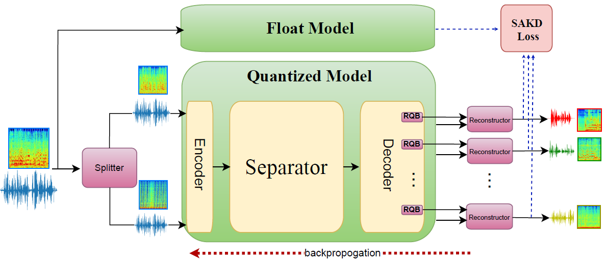

# FQSS: Fully Quantized Neural Networks for Audio Source Separation

## Paper (IEEE Open Journal of Signal Processing 2024)
https://ieeexplore.ieee.org/document/10591369

## Abstract
Deep neural networks have shown state-of-the-art results in audio source separation tasks in recent years. However, deploying such networks, especially on edge devices, is challenging due to memory and computation requirements. In this work, we focus on quantization, a leading approach for addressing these challenges. We start with a theoretical and empirical analysis of the signal-to-distortion ratio (SDR) in the presence of quantization noise, which presents a fundamental limitation in audio source separation tasks. These analyses show that quantization noise mainly affects performance when the model produces high SDRs. We empirically validate the theoretical insights and illustrate them on audio source separation models. In addition, the empirical analysis shows a high sensitivity to activations quantization, especially to the network's input and output signals. Following the analysis, we propose Fully Quantized Source Separation (FQSS), a quantization-aware training (QAT) method for audio source separation tasks. FQSS introduces a novel loss function based on knowledge distillation that considers quantization-sensitive samples during training and handles the quantization noise of the input and output signals. We validate the efficiency of our method in both time and frequency domains. Finally, we apply FQSS to several architectures (CNNs, LSTMs, and Transformers) and show negligible degradation compared to the full-precision baseline models. 





## Table of Contents
- [Installation](#installation)
- [Datasets](#datasets)
- [Usage](#usage)
- [Results](#results)
- [References](#references)

## Installation
To install the necessary dependencies, run the following commands:
```sh
git clone https://github.com/yourusername/FQSS.git
cd FQSS
pip install -r requirements.txt
```

To install SoundTouch (an open-source audio processing library), please follow the installation guidance in:
https://www.linuxfromscratch.org/blfs/view/svn/multimedia/soundtouch.html

To install ffmpeg, run:
```sh
sudo apt-get install ffmpeg
```

## Datasets
### Librimix Dataset

LibriMix is an open source dataset for source separation in noisy environments. It is derived from LibriSpeech signals (clean subset) and WHAM noise. It offers a free alternative to the WHAM dataset and complements it.
It will also enable cross-dataset experiments. Please refer to [Librimix](https://github.com/JorisCos/LibriMix) for more information.

### Musdb18HQ Dataset

The musdb18 is a dataset of 150 full lengths music tracks (~10h duration) of different genres along with their isolated drums, bass, vocals and others stems. The uncompressed version was used for the music separation experiments that reported in the paper. 
Please refer to [MUSDB18](https://sigsep.github.io/datasets/musdb.html) for more information.

## Usage
### Quantization-Aware Training (QAT)
To run quantization-aware training (QAT), follow these steps:

#### Adapt YAML Configuration:
Modify the corresponding YAML file (under [`configs`](/configs)) with the correct arguments such as dataset paths, working directory.

#### Generate Datasets:

- LibriMix:
  - Generate the Librimix dataset according to [Librimix](https://github.com/JorisCos/LibriMix). Use the Libri2Mix 16kHz and 'min' version of the dataset. The current configurations use a resample of 0.5, to match the reported experiments setup of 8kHz in the paper. Equivalently, you can create Libri2Mix 8kHz and change the configured resample to 1 by adjusting the 'resample' value under 'dataset_cfg' in the experiment configuration under 'configs'.
  - Metadata csv files should be created in the `storage_dir` (the path you used for running `generate_librimix.sh`).
  - Create two directories: `dev` and `train`. In each one of them, copy the generated following csv files:
    - In `dev`: `mixture_dev_mix_both.csv`, `mixture_dev_mix_clean.csv`, `mixture_dev_mix_single.csv` 
    - In `train`: `mixture_train-360_mix_both.csv`, `mixture_train-360_mix_clean.csv`, `mixture_train-360_mix_single.csv`
  - Assuming you used `storage_dir` for generating the LibriMix dataset:
  - For ConvTasNet and DPTNet:
    - Set the `train` dir path in `train_dir` within `dataset_cfg`.
    - Set the `dev` dir path in `valid_dir` within `dataset_cfg`.
    - Set the `Libri2Mix/wav16k/min/test` dir path that was generated in `storage_dir` in `test_dir` within `testing_cfg`
  - For Sepformer:
    - Set the `Libri2Mix` dir path that was generated in `storage_dir` in `data_folder` within `dataset_cfg`.
    - Set the `Libri2Mix/wav16k/min/test` dir path that was generated in `storage_dir` in `test_dir` within `testing_cfg`

- Musdb18HQ:
  - Download the dataset [MUSDB18-HQ](https://zenodo.org/records/3338373). 
  - For ConvTasNet:
    - Set the dataset path in `train_dir` within `dataset_cfg`.
    - Set the dataset path in `test_dir` within `testing_cfg`.

  - For HTDemucs:
    - Set the dataset path in `test_dir` within `testing_cfg`.
    - Set the dataset path in `musdb` within `dset`.

#### Set Pretrained Model Path:

Set the float pretrained model path in 'pretrained' under training_cfg.

#### Set Working Directory:

Set work_dir with the directory path of the working directory for the training artifacts. This includes the quantized trained final model.

#### Train the Model:

Use the training script and the correct environment. For source separation on ConvTasNet, run:
```bash
train.py -env asteroid -y configs/convtasnet_2spks_8k.yaml
```

For music separation on ConvTasNet, run:
```bash
train.py -env tasnet -y configs/convtasnet_music.yaml
```

In each YAML file, the environment is detailed at the top (e.g., speechbrain for source separation using Sepformer model and htdemucs for music separation using HTDemucs model).

#### Run Evaluation:

After training is complete, the quantized model will be saved in the working directory as best_model.pth.
To run evaluation on the quantized model, set its path in the YAML file in model_path under model_cfg and run:
```bash
val.py -y configs/configuration.yaml
```
Replace configs/configuration.yaml with the specific configuration file used for the QAT experiment.

## Results

### Source separation SI-SDR on Librimix

| Network        | Float | Vanilla QAT 8bit | FQSS 8bit |
|----------------|------:|-----------------:|----------:|
| ConvTasNet [1] | 14.78 |            14.23 |     14.75 |
| DPTNet [2]     | 18.50 |            17.88 |     18.30 |
| Sepformer [3]  | 19.17 |            18.35 |     18.91 |


### Music separation SDR on Musdb18HQ 

| Network        | Float | Vanilla QAT 8bit | FQSS 8bit |
|----------------|------:|-----------------:|----------:|
| ConvTasNet [1] |  5.88 |             5.65 |      5.82 |
| HTDemucs [4]   |  7.51 |             6.83 |      7.43 |


## Citation

If you find this project useful in your research, please consider cite:

```BibTeX
@ARTICLE{10591369,
  author={Cohen, Elad and Habi, Hai Victor and Peretz, Reuven and Netzer, Arnon},
  journal={IEEE Open Journal of Signal Processing}, 
  title={Fully Quantized Neural Networks for Audio Source Separation}, 
  year={2024},
  volume={5},
  number={},
  pages={926-933},
  keywords={Quantization (signal);Task analysis;Source separation;Analytical models;Training;Degradation;Computational modeling;Source separation;quantization;DNN;SDR;compression;knowledge distillation},
  doi={10.1109/OJSP.2024.3425287}}
```
****

## References
[1] https://arxiv.org/pdf/1809.07454

[2] https://arxiv.org/abs/2007.13975

[3] https://arxiv.org/abs/2010.13154

[4] https://github.com/facebookresearch/demucs


